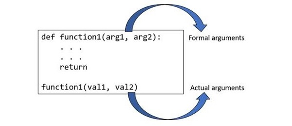

## Topics covered:

Variables, Data Types, Operators
Control Flow (if, for, while)
Functions and Lambdas
Lists, Tuples, Sets, Dictionaries
File I/O
Exceptions
Modules and Packages
Virtual Environments (venv, pip)
OOP (Classes, Inheritance, etc.)

# Functions
- Python uses pass by reference mechanism
- function argument

# Topic to cover 
set, list Comprehensions

# OOPS
-  class -> first argument to each method is self
-  class attributes - instance vs class , built-in attribute
- class vs static method
- constructor - default vs parameterized
- python property object 
- method overriding and overloading
- Dynamic Binding - According to the "duck typing" concept, "If it walks like a duck and quacks like a duck, then it must be a duck."
- Dynamic Typing - python is dynamically typed lang vs statically typed lang ( java , C/C++)

- Interface - formal and informal implemention (the principle of duck typing)
- What is metaprograming or metaclasses. Type is a metaclass
- Relationship between object and type. Understand circular relationship 
- how class is created under the hood ? when class MyClass: defined , python invoked type("MyClass", (base_classes,), class_dict)

File:
- OS module of Python provides a wide range of useful methods to manage files and directories
- os.path is another module which provideds few more methods to manage files and directories
- File object is created using open(). File class defined methods to perform various operation on file.

Difference against java 
1. Doesn't allow multiple constructor , even if you define multiple it takes the last one but there is a way to achive similar functionality.
2. Access modifier - name Mangling

Design Philosophy

## Object & Type circular relationship.
Visual Diagram
1. Everything is object in python even class is a object 

        ┌──────────────┐
        │   object     │  (base of everything)
        └──────┬───────┘
               │
     inherits from
               │
        ┌──────▼───────┐
        │    type      │  (class of all classes)
        └──────────────┘

Relationships:
- object is an instance of type
- type is a subclass of object
- type is an instance of itself
